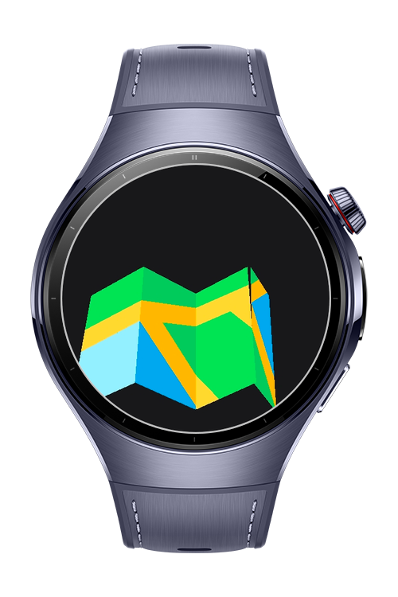
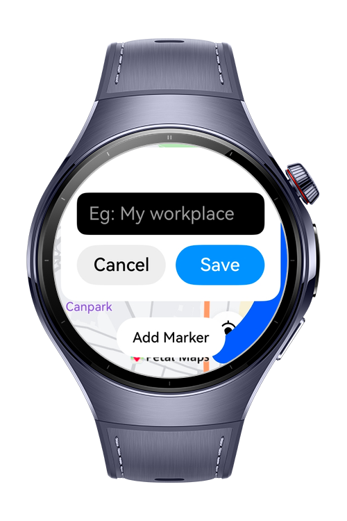

> **Note:** To access all shared projects, get information about environment setup, and view other guides, please visit [Explore-In-HMOS-Wearable Index](https://github.com/Explore-In-HMOS-Wearable/hmos-index).

# GeoPulse - Location-based Notes Sample App

**GeoPulse** is a HarmonyOS wearable sample application built with **MapKit, LocationKit, NotificationKit, BackgroundTaskKit, and RDB**.  
The app allows users to place markers on the map with attached text notes. When the user comes within 100 meters of the saved marker, a local notification is triggered showing the note content.

# Preview

<p align="left">
  
  
  
  
</p>


# Use Cases

- **Location-based Notes**: Attach text to a location marker and get notified when near it.  
- **Background Tracking**: Monitor user location in the background with low energy usage.  
- **Notification Demo**: Demonstrates HarmonyOS notification system with dynamic text.  
- **Wearable Integration**: Showcases MapKit + LocationKit usage on Huawei Watch 5.  


# Technology

## Stack
**Languages**: ArkTS, ArkUI  
**Frameworks**: HarmonyOS SDK 5.1.0  
**Tools**: DevEco Studio 5.1.0  
**Libraries/Kits**:  
- @kit.MapKit  
- @kit.LocationKit  
- @kit.NotificationKit  
- @kit.BackgroundTaskManager  
- @kit.DataAbility.Rdb  

## Required Permissions
- `ohos.permission.LOCATION`  
- `ohos.permission.APPROXIMATELY_LOCATION`  
- `ohos.permission.NOTIFICATION_CONTROLLER`  
- `ohos.permission.RUNNING_LOCK`  


# Directory Structure
```
entry/src/main/ets/
├── constants/
│ └── StyleConstants.ets
├── entryability/
│   └── EntryAbility.ets
├── entrybackupability/
│   └── EntryBackupAbility.ets
├── model/
│   └── FavoriteLocation.ets
├── pages/
│   ├── Index.ets
│   └── SplashPage.ets
├── service/
│   ├── LocationTable.ets
│   └── Rdb.ets
```


# Constraints and Restrictions

## Supported Device
- Huawei Watch 5  


# License (MIT)

**GeoPulse** is distributed under the terms of the MIT License.  
See the [LICENSE](LICENSE) file for more information.  
